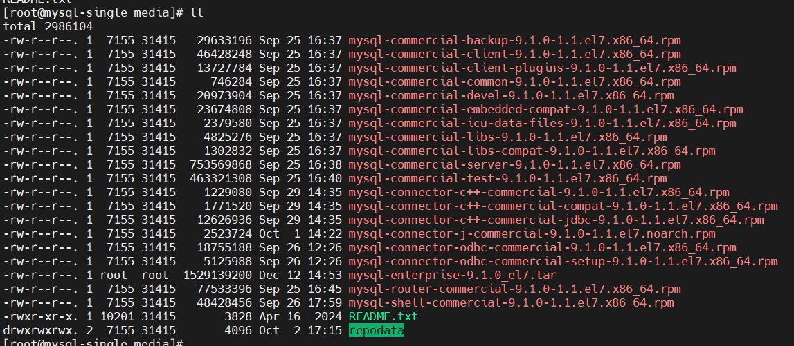
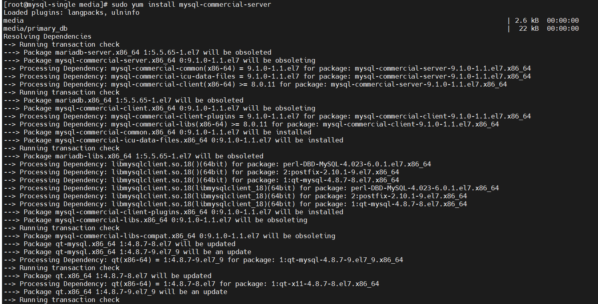
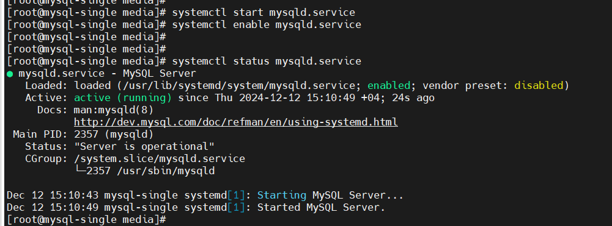
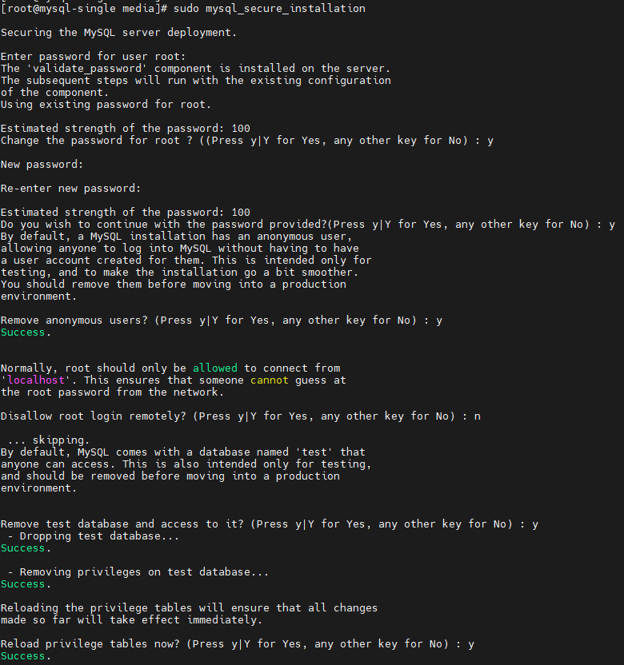
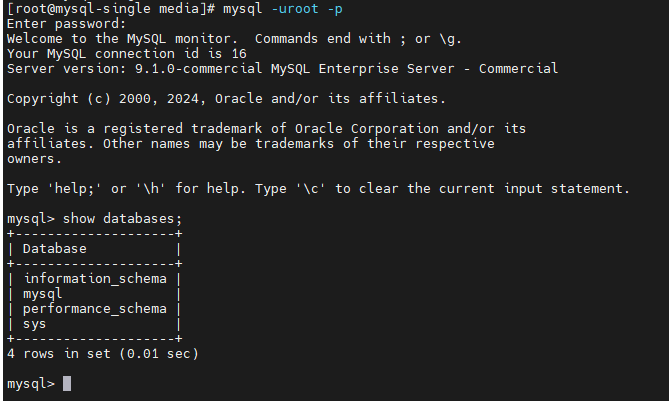

---
ShareButtons:
- linkedin
- whatsapp
- twitter
ShowReadingTime: true
date : '2024-12-12T10:57:33+07:00'
draft: false
tags:
- database
- mysql
title : 'Installing MySQL 9 Enterprise Edition in Oracle linux 7.8'
---

After you have downloaded the MySQL Enterprise Edition software bundle from the MySQL Enterprise Edition Downloads page on OTR, follow the installation instructions below for your platform.

 
Oracle Linux /Red Hat Enterprise Linux

1. Unpack the downloaded tar bundle:
    ```go
    tar xvf mysql-enterprise-<REL_VERSION>_el<VERSION>_<ARCH>_bundle.tar

    tar xvf mysql-enterprise-9.1.0_el7.tar
    ```
    ss:
    

    ss:
    


2. Set up a local Yum package repository for easy management of your MySQL Enterprise products and components:
    Add the MySQL GPG key to your system in order to verify packages at install time:

    ```go
    sudo rpm --import https://repo.mysql.com/RPM-GPG-KEY-mysql-2023
    ```
    ss:
    

3. Install utilities that aid in Yum repo setup:

      ```go
      sudo yum install yum-utils
      ```

      ss:
      

  

4. Add the downloaded developer bundles as a local yum repo:


    ```go
    sudo yum-config-manager --add file:///path/to/rpms 

    sudo yum-config-manager --add-repo=file:///media/
    ```
    ss:
    


5. [optional] For Oracle/Red Hat Linux 8 only: Disable the MySQL module that comes with your OS distribution:

    ```go
    sudo yum module disable mysql
    ```

6. Install MySQL Server or any of the products included in the bundle, using any of the following commands:


    ```go
    sudo yum install mysql-commercial-server
    sudo yum install mysql-commercial-backup
    sudo yum install mysql-connector-c++-commercial
    sudo yum install mysql-connector-c++-commercial-jdbc
    sudo yum install mysql-connector-j-commercial
    sudo yum install mysql-connector-odbc-commercial
    sudo yum install mysql-connector-odbc-commercial-setup
    sudo yum install mysql-connector-python3-commercial
    sudo yum install mysql-router-commercial
    sudo yum install mysql-shell-commercial
    ```

    ss:
    

7. Check if already installed, and completed
    


8. Start and enabled service mysql

     

9.  Find password get from mysqld.log

    ```go
    sudo grep 'temporary' /var/log/mysqld.log
    ```

10. Secure MySQL Installation

    ```go
    sudo mysql_secure_installation

    Enter current password for root (enter for none): 
    Set root password? [Y/n] Y
    New password: 
    Re-enter new password: 
    Do you wish ...? : Y
    Remove anonymous users? [Y/n] Y
    Disallow root login remotely? [Y/n] n
    Remove test database and access to it? [Y/n] Y
    Reload privilege tables now? [Y/n] Y
    ```
    ss
    

11. Test login

    ```go
    mysql -uroot -p
    ```
    ss:
    

